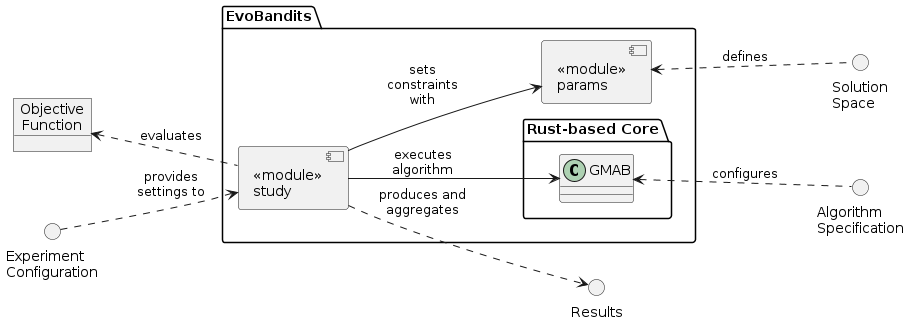

# UML diagrams for the EvoBandits package

Created using [PlantUML Online](https://plantuml.online/uml/2orEBLBGjLDmB2Z8oKnEBCdCprEmKYXABInDBIxXIamkoInBB4b5bkP2LgeBr1eACWAafxWWFwyubIib5Qis0000).

## Components and interfaces of EvoBandits



```txt
@startuml
allowmixing
left to right direction

object "Objective\nFunction" as objective
() "Algorithm\nSpecification" as algorithm
() "Solution\nSpace" as solutionspace
() "Experiment\nConfiguration" as config
() "Results" as results

package EvoBandits {
  component "<<module>>\nstudy" as study
  component "<<module>>\nparams" as params
  
  package "Rust-based Core" as core {
    class "GMAB" as gmab
  }
}

config ..> study: "provides\nsettings to"
objective <.. study: "evaluates"
params <.. solutionspace: defines
study ..> results: "produces and\naggregates"
gmab <.. algorithm: configures
study --> params: "sets\nconstraints\nwith"
study --> gmab: "executes\nalgorithm"
@enduml
```

## Class diagram of the evobandits.params module.


```txt
@startuml
top to bottom direction
skinparam ClassAttributeIconSize 0

abstract BaseParam {
  + size
  + bounds()
  + decode()
}

class IntParam {
  + size
  + low
  + high
  + bounds()
  + decode()
}

class FloatParam{
  + size
  + low
  + high
  + n_steps
  + log
  + bounds()
  + decode()
}

class CategoricalParam{
  + size
  + choices
  + bounds()
  + decode()
}

BaseParam <|-- IntParam
BaseParam <|-- CategoricalParam
BaseParam <|-- FloatParam
@enduml
```